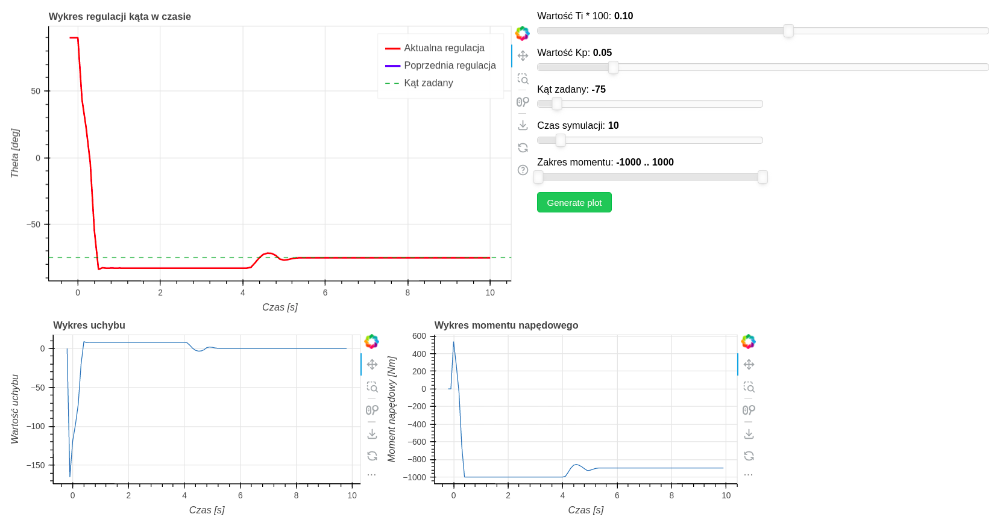
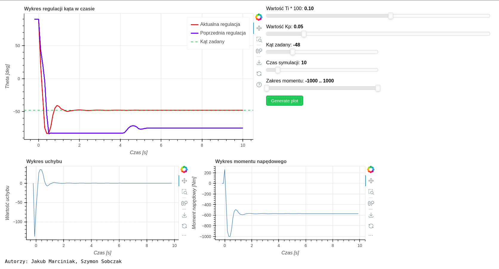
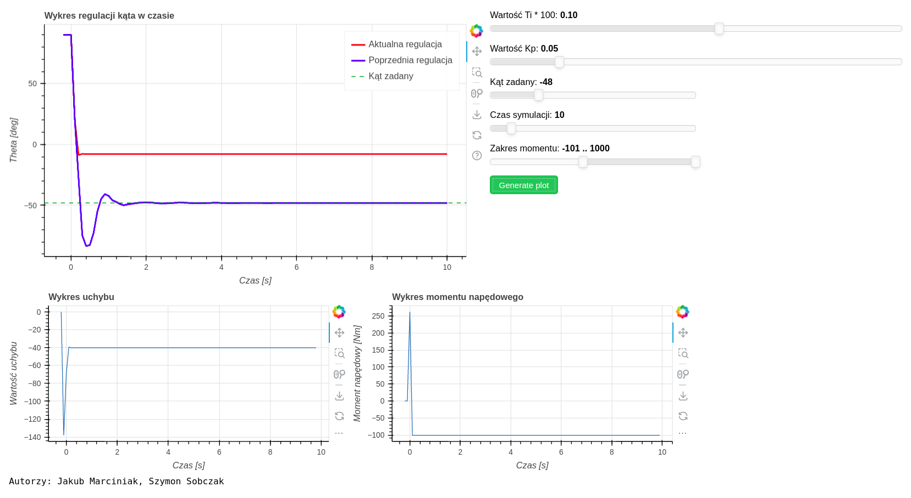

# Reverse-pendulum-using-PI-controller-and-Bokeh
A university project with simple automatic control system for inverse pendulum using a PI controller. I used Bokeh o visualize the data.

### Some pics:

